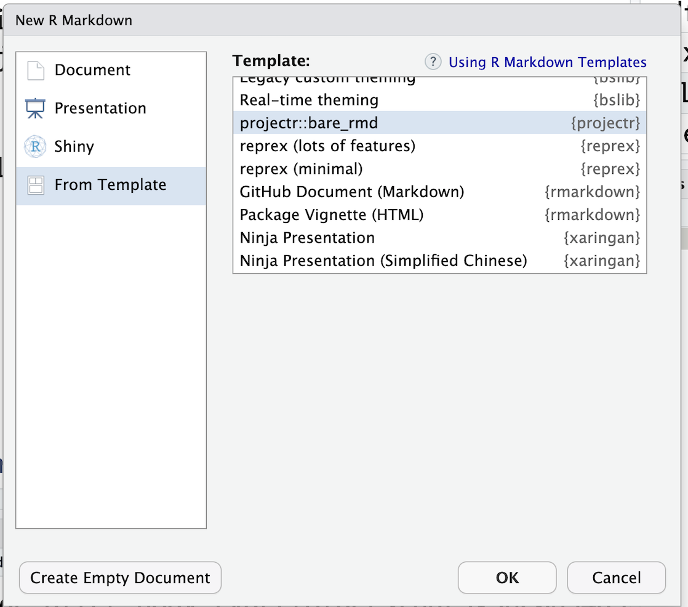

```{r, echo = FALSE, message = FALSE}
library(tidyverse)

knitr::opts_chunk$set(
  collapse = TRUE,
  fig.width = 6,
  fig.asp = .6,
  message = FALSE,
  out.width = "90%",
  warning = FALSE
)

theme_set(theme_bw() + theme(legend.position = "bottom"))
```


## Slides

<iframe src="slides/cl_slides.html" width="800" height="600" allowfullscreen = "true"></iframe>


## Examples

### Example 1: creating a new project

In this exercise we will create a new project that will be used throughout the rest of this course. I highly encourage you to follow along with me.


1. Use `projectr::proj_start()` to initiate a new project called `20240722_sismid_repro`.   Set up a directory in a separate location using the argument `data_dir`. I typically store my data on OneDrive, but the idea is to put it in a secure location.


**Run the following code in R**

```{r, eval = FALSE}

# Setting up a folder WITH a symbolic link to the data subfolder
projectr::proj_start(proj_dir = "~/icloud/Documents/projects/2024/20240722_sismid_repro", 
                     data_dir = "~/onedrive/Data/2024/20240722_sismid_repro") 
```

Next, open the new project by double clicking the `.Rproj` icon. This will open up a new Rstudio session with the working director set to that project folder. It will also set the working directory of the terminal tab to that folder.


2. Download the [data download script](scripts/01_data_download.R) and save it in the `source` folder of your new project directory as `01_data_download.R`.

It would be fine to copy/paste the code for `01_data_download.R` and saving it via point and click, but you can also do this using tools from the command line module by entering the following into the terminal:

```{bash, eval = FALSE}
echo '# install.packages("RSocrata")
library("RSocrata")
library(tidyverse)

# download longitudinal Covid WW concentration data from API
covid <- read.socrata(
  "https://data.cdc.gov/resource/g653-rqe2.json",
  app_token = Sys.getenv("TOKEN"),
  email     = Sys.getenv("EMAIL"),
  password  = Sys.getenv("PASSWORD")
) %>%
  mutate(date_downloaded = Sys.Date())


# download cross-sectional Covid WW concentration data from API, which will be used to get county names
counties <- read.socrata(
  "https://data.cdc.gov/resource/2ew6-ywp6.json",
  app_token = Sys.getenv("TOKEN"),
  email     = Sys.getenv("EMAIL"),
  password  = Sys.getenv("PASSWORD")
)


## save intermediate data object and data data was accessed
save(covid, counties, file = here::here("data", "raw.Rdata"))' > source/01_data_download.R
```


Check that you have saved this script in the `source` folder. 


3. Make an Rmarkdown document that knits to html called `build_analysis.Rmd` and put it in the `analysis` folder of your project directory.




We will come back to the `build_analysis.Rmd` document later in the lecture.


### Example 2: adding `.Renviron` variables

1. Add a `.Renviron` file to the root directory of your `20240722_sismid_repro` project folder.

Open the terminal. I will use the terminal tab of the `20240722_sismid_repro` project. First, check that your working directory is `20240722_sismid_repro`.

```{bash, eval = FALSE}
pwd
```

If you are not in the correct directory use the `cd` command to move into `~\20240722_sismid_repro`. Next, create and open the `.Renviron` file.

```{bash, eval = FALSE}
touch .Renviron
open .Renviron
```

2. Edit the `.Renviron` file by defining variables called TOKEN, EMAIL, an PASSWORD that contain your app token, and email and password used to obtain your app token.  

Your edited `.Renviron` file should look something like this:

```{r, eval = FALSE}
PASSWORD="password333"
EMAIL="julia.wrobel@emory.edu"
TOKEN="K1MVpmwDDeefZ0vPuYk2wRN"
```

Close your R session and then reopen it by double-clicking `20240722_sismid_repro`.  Your environment variables defined through `.Renviron` should now be defined. 

You can check by typing the following into the R console:

```{r}
Sys.getenv("EMAIL")
```

This should print out your email address.

3. Add the `.Renviron` file to your `.gitignore` file. 

This is not necessary for accessing the environment variables you just defined, but will be important for later in the course when we start using git and GitHub. **You do not want to accidentally put your .Renviron on GitHub**, and by adding the file to `.gitignore` we can avoid this mistake.

To do this, go to your terminal and execute the following  two lines of code:

```{bash, eval = FALSE}
echo "" >> .gitignore # ensures you are writing on a new line
echo ".Renviron" >> .gitignore
```

Alternatively, you can just open the .gitignore file and add `.Renviron` on a new line. Sometimes I find this to be simpler.

4. Check that the code in your `01_data_download.R` file will run.

Let's do a sanity check to make sure that the environment variables are set up correctly. Open up the `01_data_download.R` file, and try running the code. If it works, you are all set!


### Example 3

https://data.cdc.gov/Public-Health-Surveillance/NWSS-Public-SARS-CoV-2-Wastewater-Metric-Data/2ew6-ywp6/about_data

## Breakout exercises

### Exercise 1


1. Use `projectr::proj_start()` to initiate a new project called `20240722_YOURNAME_sismid`.   Use the argument `data_dir = NULL`. Where is your data being stored?
2. Using the terminal, set up a symbolic link for where you will store data for this course that points to `20240722_YOURNAME_sismid/data`.


<button type="button" class="collapsible">View solution</button>
<div class="content">

Set up the project directory structure.

```{r, exercise1, eval = FALSE}
## set up a new project
# devtools::install_github("julia-wrobel/projectr")
library(projectr)


# Setting up a folder without a symbolic link to the data subfolder
projectr::proj_start(proj_dir = "~/icloud/Documents/projects/2024/202407_wrobel_sismid", 
                     data_dir = NULL) 

```


Set a symbolic link by opening a Terminal window and executing code like the following. Note that I am storing my data in a folder on OneDrive and you may want to store yours elsewhere.

```{bash, eval = FALSE}
ln -s "~/onedrive/Data/2024/202407_wrobel_sismid"  "~/projects/2024/202407_wrobel_sismid/data" 
```


</div>


## Additional reading

* [Jenny Bryan and James Hester's chapter on project-oriented workflow](https://rstats.wtf/project-oriented-workflow.html)
* [Hadley Wickham on R Projects](https://r4ds.had.co.nz/workflow-projects.html)
* [My version of projectr package on Github](https://github.com/julia-wrobel/projectr)


<script language="JavaScript" src="custom_js.js"></script>
