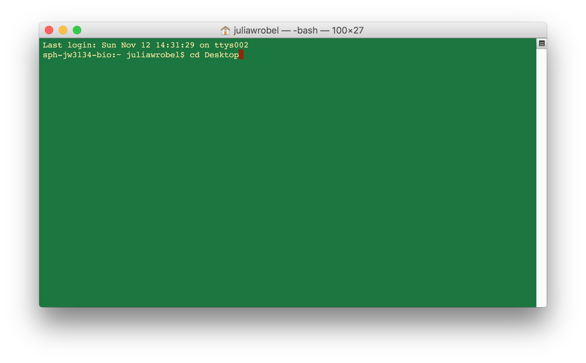
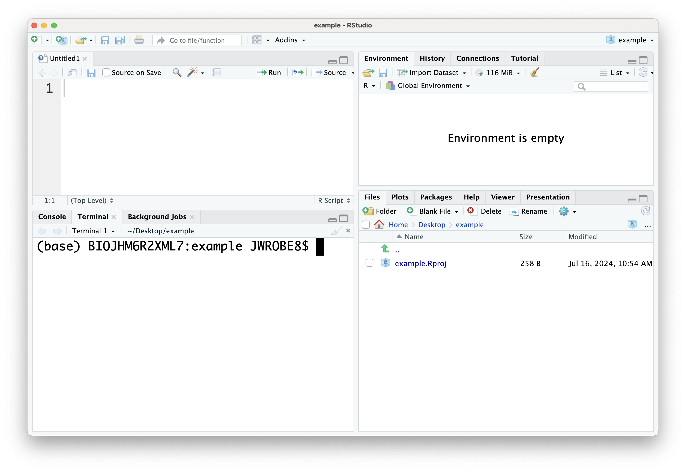
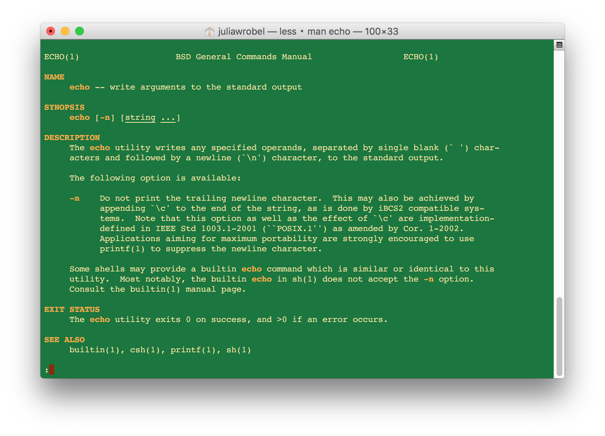

```{r xaringan-themer, include=FALSE, warning=FALSE}
library(xaringanthemer)
extra_css <- list(
    "ul" = list(`margin-bottom` = "0.5em",
      `margin-top` = "0.5em"),
  	"p" = list(`margin-bottom` = "0.25em"),
	"ul li" = list(`margin-bottom` = "10px"),
	"a" = list(color = "#007dba"),
	"a:hover" = list("text-decoration" = "underline"),
	".green" = list(color = "#348338"),
	".red" = list(color = "#da291c"),
  ".remark-slide-content" = list(`font-size` = "24px")
)

style_mono_accent(
  base_color = "#012169",
  header_font_google = google_font("DM Sans"),
  text_font_google   = google_font("DM Sans", "400", "400i"),
  code_font_google   = google_font("Courier Prime"),
  extra_css = extra_css
)
```
<style type="text/css">
.remark-slide-content {
    font-size: 24px
}
</style>


## Operating systems

* Windows
  * Not always programmer friendly
* Mac OSX
  * Better for programming
  * Under the hood, is just Unix
* Unix-based OS (Linux, Solaris, etc...)
  * Best for programming

We'll learn to interact with our computer like it's a Unix OS. 
* Best practices for programming
* Needed for AWS and Docker (later)

???
Assess how many students have which types of operating systems.
---


## Some terminology

__Shell__
* user interface for interacting with a computer
* the "outermost" layer of the operating system

__Graphical user interface__ (GUI)
* visual interface (icons, menus, etc...) for interacting with computer
* "Point-and-click"

__Command line interface__ (CLI)
* text-based interface for interacting with computer
* e.g., `bash`, `sh`, `tcsh`, `zsh`, ...

???
A shell is essentially a user interface that allows users to interact with the OS. It provides ways to execute commands, run programs, and manage the system. Can be graphical or command-line.

GUIs are pretty and user-friendly because anyone who can read and operate
a mouse can interact with them, even with very little about computers. 
However, they are antithetical to our endeavor for reproducible research.

We will instead rely on the CLI to run all our programs. We will focus on 
`bash`. 
---

## Some terminology

__Shell script__
* plain text file designed to be run by the shell

__Terminal__
* "terminal emulator"
* a program that lets you interact with the shell

__Why use a terminal?__ 
* work faster and more efficiently: no mouse or touchpad!
* better debugging when you break stuff (i.e. Git/GitHub)
* impress your friends and family?
* reproducibility!!!!

???

Scripts are the ultimate "paper trail". We can scrutinize the script
to see exactly what the computer was told to do. We are working toward
scripting all aspects of data cleaning, analysis, and report generation. 

---


## Terminal

If Windows, use [Ubuntu](https://www.microsoft.com/en-us/p/ubuntu/9nblggh4msv6?activetab=pivot:overviewtab) for Windows
* Or other Linux distribution (e.g., [Debian](https://www.microsoft.com/en-us/p/debian/9msvkqc78pk6?rtc=1&activetab=pivot:overviewtab))
* Biggest difference is how software installed

<div>

If Mac, use [Terminal](https://support.apple.com/guide/terminal/open-or-quit-terminal-apd5265185d-f365-44cb-8b09-71a064a42125/mac)
* Or [iTerm2](https://www.iterm2.com/features.html) -- more features

<div>

If Linux, whatever terminal emulator comes with your distribution. 

???
Linux on Windows is a relatively new feature. I suggest Ubuntu or Debian
as these are the most common distributions on resources you might use. 
There's practically little difference for our purposes. Most of my 
examples later will likely use Ubuntu though, so if you have no strong
preference, then I'd stick to that. 

---

## Terminal

Your open terminal will look something like this: 



You'll see a _prompt_, which is an alphanumeric string that (usually) ends in __$__. Commands are typed after the __$__. 

???
Your open terminal will look something like this (mine is customized to be green which is not the default).
In the screenshot provided I typed the command `cd Desktop`, which we'll get to shortly.

The terminal is the way we interact with the shell by issuing text-based
commands.

We'll be working with bash. If for some reason bash is not the default 
shell (and you want it to be) this can be changed in Terminal settings. For Mac the default is zsh, which functions similarly to bash.

---

## Using the terminal through RStudio

You can also use the terminal directly in Rstudio!
* Rstudio introduced the terminal tab in 2017
* For our course, this may be the simplest approach

__Display the Terminal tab__: If the tab isn't visible, you can display it by going to Tools > Terminal > Move Focus to Terminal. 
* Can also use the keyboard shortcut Shift+Alt+M or Shift+Option+M on Mac.

???
Try opening Rstudio and seeing if you have a terminal tab. If you don't, raise your hand or use the Slack channel and Emily will come around to help.
---

## RStudio terminal



???
Try opening your terminal, either through Rstudio or otherwise. It may be helpful to follow along and code with me during this section, so please ask questions or summon the TA if you are having trouble.
---

## Working directories

What is a working directory?

???
a working directory is the folder on your computer where your files are currently being saved or accessed when you run a program or command. Think of it as the default location where your computer looks for files and where it saves new files unless you tell it to look somewhere else.

---

## Moving around directories

Folders within you computer are called **directories**. 
You can navigate around to different directories, remove or create directories, remove or create files, move files around, and list their contents all from the terminal.


These next sections may seem fairly basic but these are also the commands I use the most often, so I'm going to spend some time on them. 

---

## Moving around directories

| __Command__   | __Action__                   |
|:-------------:|------------------------------|
| `pwd`         | print working directory      |
| `cd`          | change directory             |
| `ls`          | list files in directory      |

<div>

* __cd__: Takes you to the home directory
      * `cd ..`: Moves up one directory
      * `cd ../..`: Moves up two directories
* __ls -a__: list **hidden** files as well as other files
      * Hidden files are often part of the instructions for the OS or a particular application
      * Usually invisible when searching through folders
      * Examples: .git, .gitignore, .Rhistory 
      

```{bash}
pwd
```

---


## Absolute vs. relative file paths


.pull-left[.center[
Absolute paths
* .left[`/Users/juliawrobel`]
* .left[`~/Documents`]
* .left[`/`]
]]

.pull-right[.center[
Relative paths
* .left[`./Documents`]
* .left[`../Documents`]
* .left[`../../`]
]]

* Absolute paths include the __whole path__ for a directory
* Relative paths depend on the working directory that they are executed in 
  * The `./` means "in the current directory"
  * The `../` means "in one directory
up from the current directory".

???
When we get to project management, we will prefer relative paths. It makes
sharing code easier -- between different users or, with yourself, on a 
different computer (e.g., your laptop vs. AWS). The two file systems are probably 
(definitely) structured differently, but if they share a  project folder with 
the same relative structure, then code with relative paths should still work.

---

## Adding/removing files

| __Command__     | __Action__                   |
|:---------------:|------------------------------|
| `mkdir`         | make a new directory         |
| `rm`            | delete a file or directory   |
| `mv`            | move a file or directory     |
| `cp`            | copy a file or directory     |


???
Good to know that when you delete a file in bash, it's gone forever
---

## Structure of a bash command

```{bash, eval = FALSE}
command [options] [arguments]
```

1. `command`: the bash function you want to run, e.g. `ls`, `cd`, `echo`, etc.

2. `options`: also called "flags", these are additional parameters to modify the behavior of the command, e.g., 
  * `ls -R` lists all directories and contents recursively
  * `ls -aR` recursively lists all files and hidden files

3. `arguments`: inputs to the command, such as file names or other data that tell the command what to operate on
  *  `rm` what? `cp` what?
  * `ls \Documents` lists all files in the documents folder

???
We have already discussed a few bash commands (`pwd`, `ls`, `cd`). More generally, bash commands have the form.

You can string together multiple `-` options, e.g., `ls -la` executes
as `ls -l -a`.
---

## bash help files

To see available options check `man command`.



???
The `man`'s for the various commands are sometimes not as helpful
as just googling, "How do I ... `command` bash". ChatGPT is helpful too.
---


## Solving computing problems

* `man [command]` 
* Google (with `site:stackoverflow.com`?)
* ChatGPT
* Ask friends/classmates
* .red[Try stuff!]

Breakout exercises are designed to force you to try new things.
* Learning how to learn!

???

I find manuals for Unix commands are often cryptic and not always helpful. 
Reading them on occasion is still useful. 

Learning to code is a lot like a learning a language. It can be very
frustrating that you know *what* you want to say, but you don't know 
*how* to say it (or you know how, but in another language!). You only
get better at language by forcing yourself to use it.

Don't be satisfied with just copy/pasting an answer from StackOverflow. 
Try (for at least a couple minutes) to understand how it works. This is 
a worthwhile investment. 

Also, keep in mind that ChatGPT is sometimes (confidently) wrong!
---


## Try it out!

Open the terminal and perform the following tasks:

1. What is your current working directory?
2. In your current directory, make a directory named `tmp`
3. Navigate into this new folder called `tmp`
4. Add an empty file named `tmp_file`
5. Within `tmp`, add an empty directory named `another_tmp`
6. Within `another_tmp`, add an additional empty file named `another_tmp_file`


Hint: if you need some help, check out the solutions under `Exercise 1`.

---

## Group exercise

Next, get into breakout groups and perform the following tasks:

1. list all files with sizes displayed in bytes/kilobyes/megabytes
2. remove `tmp_file`
3. rename `another_tmp_file` to `such_a_cool_file`
4. remove `tmp` directory *and* all its contents


---


## Redirects and pipes

| __Command__     | __Action__                              |
|:---------------:|-----------------------------------------|
| `>`             | redirect output to file                 |
| `>>`            | redirect output and append to file      |
| `<`             | have input come from a file             |
| <code>&#124;</code> | output of command becomes input of next | 

Piping and redirects give you __flexibility__ in coding. 
---


## To bash or not to bash

```{bash, hamlet, eval = FALSE}
# download hamlet text from web and save 
# in file called hamlet.txt
curl -L http://bit.ly/hamlet_txt > hamlet.txt

# lines the string "Ham" mentioned
grep "Ham" hamlet.txt

# lines with "Oph" and "Ham"
grep "Ham" hamlet.txt | grep "Oph"

# count Hamlet's lines
grep "Ham\." hamlet.txt | wc -l

# see the start of Hamlet's first 5 lines
grep "Ham\." hamlet.txt | head -5

# see the start of Hamlet's last line
grep "Ham\." hamlet.txt | tail -1 
```

???

`curl` is useful for downloading text files from the web. `-L` means to 
follow any re-directs, if the url redirects to elsewhere.

`wget` also useful for web downloads.

`head`, `tail`, and `wc` are generally useful commands. 

Try this out for yourself.

---


## Wild cards

| __Command__     | __Action__                              |
|:---------------:|-----------------------------------------|
| `*`             | match anything                          |
| `?`, `??`, ...  | match a single character                |
| `[...]`         | match a range of characters             |

```{bash, wildcards, eval = FALSE}
# files in cwd with .txt extension
ls -l *.txt
# all files in cwd named a_file with three character extension
ls a_file.???
# .txt files in cwd name a_file, b_file, ..., e_file
ls [a-e]_file.txt
```

---

## Useful command line shortcuts

| __Key stroke__         | __Action__                              |
|:----------------------:|-----------------------------------------|
| <code> &#8593;</code>  | move to previous command                |
| <code> &#8595;</code>  | move to next command                    |
| `tab`                  | autocomplete command or file            |
| `ctrl+c`               | cancel (running) command                |
| `ctrl+z`               | suspend command                         |
| `ctrl+r`               | search for command in history           |
| `ctrl+l`               | clear the screen                        |

???

If you take nothing else from this page, remember to use `tab`!

---

## Variables

Variables are 
* assigned using `=` ;
* referenced using `$` (possibly with `${}`).

```{bash, variables, eval = FALSE}
# bad -- no spaces are allowed!
a = "some"
# good
a="some"

# references a
echo a
echo $a
echo "The value of a is $a"

# curly braces are for avoiding ambiguity
echo "I am printing $athing"
echo "I am printing ${a}thing"
```

???

Remember the command structure: `a = 12` gets interpreted as "run command 
`a` with options `=` and `12`".

---


## File permissions

If you run `ls -l`, the far left column shows file permissions:
* e.g., `-rw-r--r--` or `drwxr-xr-x`

First character is __file type__. Then comes __read__ (`r`), __write__ (`w`), and execute (`x`) permissions for __user__, __group__, __others__.

Executing `+x` (essentially) makes the file executable for everyone.

See slide notes for more options for `chmod`.

???

Often, you'll see commands like `chmod 755 file.sh`. To understand this way 
of setting permissions, think about a series of bits (how the computer 
interprets your settings): 

`rwx rwx rwx = 111 111 111`  
`rw- rw- rw- = 110 110 110`  
`rwx --- --- = 111 000 000`  
and so on...  Thus,  
`rwx = 111`, which in binary = 7  
`rw- = 110`, which in binary = 6  
`r-x = 101`, which in binary = 5  
`r-- = 100`, which in binary = 4  
`--- = 000`, which in binary = 0  

Some common values summarized below: 

| __Value__         | __Meaning__                                  |
|:-----------------:|----------------------------------------------|
| `777`             | No restrictions. Everyone can do anything.   |
| `755`             | Owner writes. Everyone can read and execute  |
| `700`             | Owner can do everything. Others nothing.     |
| `644`             | Owner can read/write. Others can read only.  |

---


## Vim

Vim is a minimalistic text editor that is built into Unix and is often the default text editor within the terminal.

Key Features:

1. Modal Editing:
  * Normal Mode: Navigate and manipulate text.
  * Insert Mode: Insert and edit text.
  * Visual Mode: Select and highlight text.

2. Commands
  * Performs complex text manipulations with minimal keystrokes.
  * Examples: `dd` (delete line), `yy` (yank/copy line), `p` (paste).


???
Vim is pretty old school but knowing a couple of commands can help you out in some case (for example with merge conflicts, which we will get to when we talk about git).
---

## Basic vim commands

__Opening and exiting vim__
* `vim filename`: open a file in vim
* `:w`: save changes
* `:q`: quit vim
* `:wq`: save changes and quit

__Navigating in vim__
* `h`, `j`, `k`, `l`: move left, down, up, and right
* `gg`: go to the beginning of the file
* `G`: go to the end of the file

__Editing text__
* `i`: enter Insert mode before the cursor
* `a`: enter Insert mode after the cursor

---

## Installing Vim

If vim is not pre-installed, here are some example installation instructions:

* On Debian-based systems (e.g., Ubuntu): `sudo apt-get install vim`
* On macOS (using Homebrew): `brew install vim`

---

## Group exercise

In your breakout group, write bash code that executes each of the following.

1. Write a sentence or two about Atlanta, or anything you'd like, and store it in a file called "atlanta.txt" within a folder called "atlanta".
2. Use vim to edit this file in some way (e.g. add some more text).
3. Save the results and exit vim.
