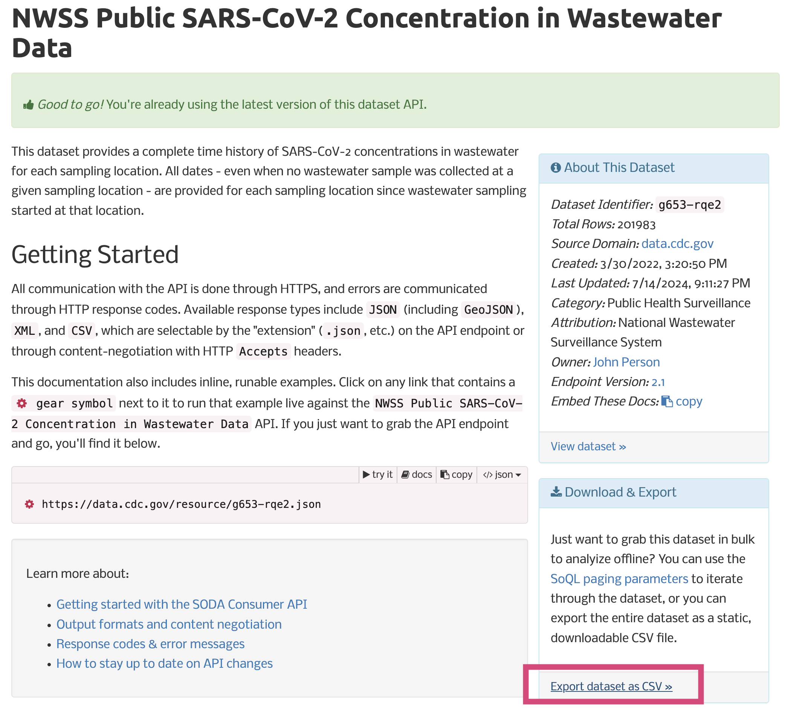

```{r xaringan-themer, include=FALSE, warning=FALSE}
library(xaringanthemer)
extra_css <- list(
    "ul" = list(`margin-bottom` = "0.5em",
      `margin-top` = "0.5em"),
  	"p" = list(`margin-bottom` = "0.25em"),
	"ul li" = list(`margin-bottom` = "10px"),
	"a" = list(color = "#007dba"),
	"a:hover" = list("text-decoration" = "underline"),
	".green" = list(color = "#348338"),
	".red" = list(color = "#da291c"),
  ".remark-slide-content" = list(`font-size` = "24px")
)

style_mono_accent(
  base_color = "#012169",
  header_font_google = google_font("DM Sans"),
  text_font_google   = google_font("DM Sans", "400", "400i"),
  code_font_google   = google_font("Courier Prime"),
  extra_css = extra_css
)
```
<style type="text/css">
.remark-slide-content {
    font-size: 24px
}
</style>

## CDC open data

The CDC has [1331](https://data.cdc.gov/browse) open-source datasets available at [data.cdc.gov](https://data.cdc.gov).
* Diverse topic areas injury & violence, smoking, pregnancy, and chronic disease.
* Great source of Covid surveillance data


FYI, under the OPEN Government Data Act (2018), government data is required to be made available in open, machine-readable formats, while continuing to ensure privacy and security.
* [data.gov](https://data.gov/) hosts additional 250K+ datasets

---


## Covid19 wastewater data

Throughout this course, we will work with the National Wastewater Surveillance System (NWSS) Public SARS-CoV-2 Concentration in Wastewater Data.
* SARS-CoV-2 concentration at different sampling locations
* Updated daily


__Longitudinal data__
* Provides concentrations over time 
* 4 columns


__Cross-sectional data__
* Current concentrations and other summaries
* 16 columns, including State, County

---


## Covid19 wastewater data

We will merge these datasets and analyze concentration over time in different counties. 
* Data can be downloaded from [Socrata](https://dev.socrata.com/foundry/data.cdc.gov/g653-rqe2)
  * Socrata is a cloud-based platform used by many local/state/federal governments for data-sharing

* Goal will be to produce end-to-end reproducible workflows with this data


???
The goal here is not to do a really complicated analysis, but to show a reproducible workflow using real open-source infectious disease data.

---

## Covid19 wastewater data



???
You can just click this button to export the data as a CSV file. Why might this not be a great idea?
---


## APIs

Luckily, this data (and all data through Socrata) can be accessed reproducibly using an **API**.

__API__: Application Programming Interface
* Essentially, a set of rules and tools that allows different software programs to communicate with each other. Think of it as a waiter in a restaurant: you tell the waiter what you want (make a request), and the waiter brings you what you asked for (the response). In the same way, an API lets one program request data or services from another program, and then delivers that data back. This makes it easier for different software systems to work together.
* A way to extract and share data within and across organizations. You are using an API every time you use a rideshare app, send a mobile payment, or use Google Maps. 
* APIs have protocols that are standardized across apps and websites

???
What does "Application Programming Interface" actually mean? I asked ChatGPT. Let's break this down. Just imagine if every time you wanted to do something someone had to point and click the intermediate steps... would this be reproducible?  I am not an expert in APIs and you don't have to be for these to be useful. 
---

## APIs

What does this mean for us?

* We can download CDC data using a script rather than point-and-click
* R interface for Socrata means this can be done directly in RStudio!
* Leads to more reproducible workflows

[Let's take a look...](https://data.cdc.gov/Public-Health-Surveillance/NWSS-Public-SARS-CoV-2-Concentration-in-Wastewater/g653-rqe2/about_data)

???
Plan to navigate around the website for this data and show them what to look at.
---

## Accessing data through RSocrata

```{r}
library("RSocrata")

df = read.socrata(url = "https://data.cdc.gov/resource/g653-rqe2.json")

tibble::as_tibble(df)
```

---


## Accessing data through RSocrata


```{r}
?read.socrata
```


---

## Terminology

__App Token__

* A unique passcode of letters and numbers that grants access to an API
* Each user signs up for their own token [here](https://data.cdc.gov/profile/edit/developer_settings)


__Fields__

* Correspond to columns in the dataset (`key_plot_id` is 1st field in our Covid dataset) 
