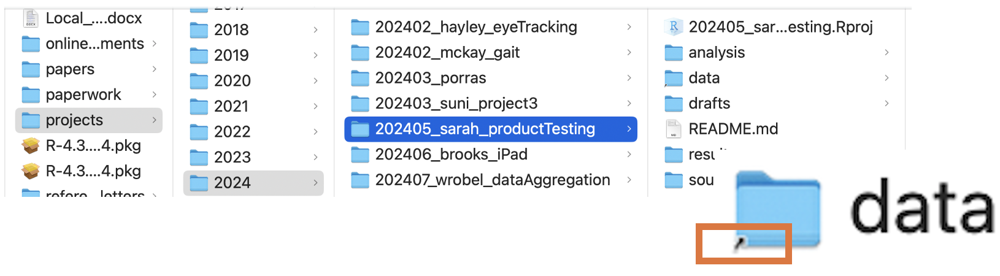
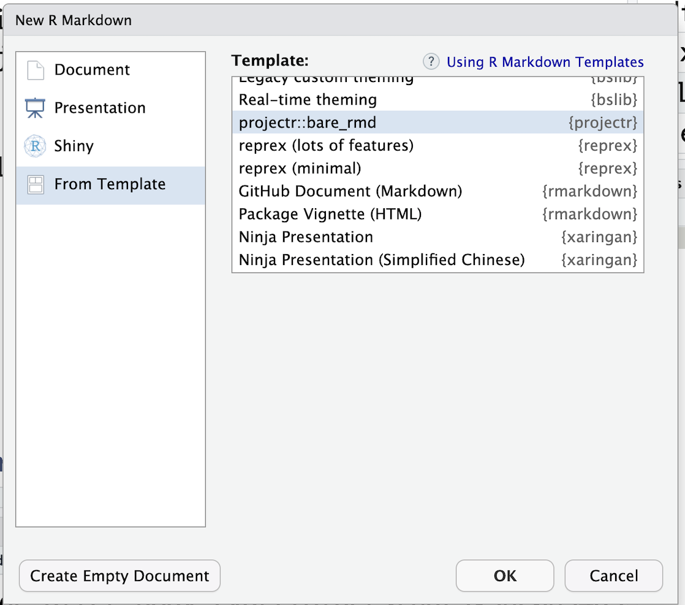
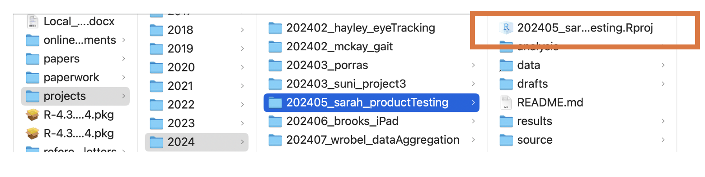

```{r xaringan-themer, include=FALSE, warning=FALSE}
library(xaringanthemer)
extra_css <- list(
    "ul" = list(`margin-bottom` = "0.5em",
      `margin-top` = "0.5em"),
  	"p" = list(`margin-bottom` = "0.25em"),
	"ul li" = list(`margin-bottom` = "10px"),
	"a" = list(color = "#007dba"),
	"a:hover" = list("text-decoration" = "underline"),
	".green" = list(color = "#348338"),
	".gray" = list(color = "#808080"),
	".red" = list(color = "#da291c"),
  ".remark-slide-content" = list(`font-size` = "24px")
)

style_mono_accent(
  base_color = "#012169",
  header_font_google = google_font("DM Sans"),
  text_font_google   = google_font("DM Sans", "400", "400i"),
  code_font_google   = google_font("Courier Prime"),
  extra_css = extra_css
)
```
<style type="text/css">
.remark-slide-content {
    font-size: 24px
}
</style>


### Basic principles

* .red[Put everything in one version-controlled directory.]
* Develop your own system. 
* Be consistent, but look for ways to improve.
  * naming conventions, file structure
* Raw data are sacred. Keep them separate from everything else. 
* Separate code and data.
* Use `make` files and/or READMEs to document dependencies.
* No spaces in file names. 
* Use meaningful file names.
* Use YYYY-MM-DD date formatting.
* .red[No absolute paths.]


???

There is not one correct way to organize a project, but there are many incorrect ways. Over time you will develop your own system for doing so. We'll discuss a few frameworks that may be helpful. 

The biggest thing is to commit to using the same structure for as long as its working for you. As you are working on many projects, be self-aware during the process. Are you consistently losing track of certain types of files? Are there gaps in the workflow that make things hard to reproduce? What can you do to fill in the gaps?

Organization might not seem like a big deal now, but remember your career is just getting started. Expect to work on 2-20 different projects a year for the rest of your working life. The number of projects you will work on is staggering! You need a way to keep track.

---

background-color: #84754e
class: title-slide, center, inverse, middle

*You mostly collaborate with yourself, and me-from-two-months-ago never responds to email.*
<div> [Karen Cranston](http://kcranston.github.io/)

???

This is as much for preserving your own sanity as it is about being reproducible (though it is about that too). There's a (big) upfront cost here, but in the end it is worth it. 

Have sympathy for your future self!

---

### What to organize?

It is probably useful to have a system for organizing:
* data analysis projects;
* first-author papers;
* talks.

The systems should adhere to the same general principles, but different requirements may necessitate different structures. 

.red[Think about organization of a project from the outset!]

???

Thinking about project organization from the outset is the most important thing. Map out (e.g., as comments in a README) how you see the project developing. Even if things change over time, it's good to have a structure in place from the beginning. 

This pertains to project directories in particular, but also to your hard drive in general. What about projects that weren't finished when I got to Emory? What about projects that I continued developing once I got here. It's a mess. Don't be like me. 

---

### Collaborative projects

Collaborative projects present a greater challenge. 
* Not everyone is comfortable with LaTeX or git or ...

I don't have a great solution for this. 
* Google drive/Word online helps to a certain extent, but you lose in other areas (reference management, math typesetting)
* [Overleaf](http://overleaf.com/) has gotten much better for LaTeX

Some advice: 
* Address organization from the outset.
* Ideally, bring people on board to your (version controlled, reproducible) system.
* Keep open lines of communication (especially if using GitHub)

???

There's almost always some pain associated with working in close collaboration with someone else on a project. The most important thing is to commit to being organized from the outset. And to agree on what that means. 

Even if some elements of the project are outside your control, you can try to bring in elements to your workflow. 
* E.g., if you receive comments with tracked changes from a colleague, incorporate them into the document, add a commit message describing who's edits they were.

If working on a shared GitHub repo, keep open lines of communication, e.g., short emails (or [slack](https://slack.com/) messages, etc...), "Just pushed `x`..."


---


### Example data analysis project (Julia)

.code-box[
YYYY_MM_PI_topic/ <br>
&nbsp;&nbsp;&nbsp; data/ <br>
&nbsp;&nbsp;&nbsp;&nbsp;&nbsp; data/raw_data.csv <br>
&nbsp;&nbsp;&nbsp;&nbsp;&nbsp; data/tidied_data.csv <br>
&nbsp;&nbsp;&nbsp; analysis/ <br>
&nbsp;&nbsp;&nbsp;&nbsp;&nbsp; analysis/exploratory_data_analysis.Rmd <br>
&nbsp;&nbsp;&nbsp;&nbsp;&nbsp; analysis/modeling.Rmd <br>
&nbsp;&nbsp;&nbsp;&nbsp;&nbsp; analysis/manuscript_figures.Rmd <br>
&nbsp;&nbsp;&nbsp;&nbsp;&nbsp; analysis/report.Rmd <br>
&nbsp;&nbsp;&nbsp; source/ <br>
&nbsp;&nbsp;&nbsp;&nbsp;&nbsp; source/clean_raw_data.R <br>
&nbsp;&nbsp;&nbsp;&nbsp;&nbsp; source/modeling_functions.R <br>
&nbsp;&nbsp;&nbsp; results/ <br>
&nbsp;&nbsp;&nbsp; literature/ <br>
&nbsp;&nbsp;&nbsp; README.md <br>
]

???
This is MY process. You'll see on the next slide David's process. We are different, were trained differently. There are some things from David's process that I have learned from putting these slides together that I like, and will adopt in the future.

Goal is to find a workflow that will be AS EASY AS POSSIBLE FOR YOU TO ADOPT AND MAINTAIN IN THE LONG TERM.

Also, the files I need for a methods project versus a more applied project may be very different

Some notes:
* separate raw data and processed data
* separate folder for figures (could possible move R code for figures there)
* `sandbox` is where I like to keep messy stuff that I'm trying out but never want to see the light of day
* informative file names for `R` scripts broken down into logical steps of a workflow
* `.gitignore` would include
  * definitely: `figs/*`, `ref_papers/*`
  * possibly: `raw_data`/`data` (if sensitive), `sandbox` (if informal)

The `00`, `01`, ... number system is something that many people use because it helps create a sortable file system. It generally works, but some workflows don't really logically follow this sort of convention (e.g., things can happen in parallel).  

---

### Example data analysis project, cont'd (Julia)

I typically have other ancillary files in my root directory as well. These are files I don't (often) modify but are important for workflow or reproducibility:

.code-box[
YYYY_MM_PI_topic/ <br>
&nbsp;&nbsp;&nbsp; YYYY_MM_PI_topic.Rproj <br>
&nbsp;&nbsp;&nbsp; .git <br>
&nbsp;&nbsp;&nbsp; .gitignore <br>
]

???

* `.gitignore` would include
  * definitely: `figs/*`, `ref_papers/*`
  * possibly: `raw_data`/`data` (if sensitive), `sandbox` (if informal)
  
  
---


### Example data analysis project (David)

.code-box[
analysis/ <br>
&nbsp;&nbsp;&nbsp; raw_data/ <br>
&nbsp;&nbsp;&nbsp; data/ <br>
&nbsp;&nbsp;&nbsp; R/ <br>
&nbsp;&nbsp;&nbsp;&nbsp;&nbsp; R/00_clean_data.R <br>
&nbsp;&nbsp;&nbsp;&nbsp;&nbsp; R/01_fit_models.R <br>
&nbsp;&nbsp;&nbsp;&nbsp;&nbsp; R/02_make_figures.R <br>
&nbsp;&nbsp;&nbsp;&nbsp;&nbsp; R/03_summarize_results.R <br>
&nbsp;&nbsp;&nbsp;&nbsp;&nbsp; R/04_report.Rmd <br>
&nbsp;&nbsp;&nbsp; figs/ <br>
&nbsp;&nbsp;&nbsp; sandbox/ <br>
&nbsp;&nbsp;&nbsp;&nbsp;&nbsp; sandbox/exploratory.R <br>
&nbsp;&nbsp;&nbsp; ref_papers/ <br>
&nbsp;&nbsp;&nbsp; Makefile <br>
&nbsp;&nbsp;&nbsp; README.md <br>
&nbsp;&nbsp;&nbsp; renv
]

???

Some notes:
* separate raw data and processed data
* separate folder for figures (could possible move R code for figures there)
* `sandbox` is where I like to keep messy stuff that I'm trying out but never want to see the light of day
* informative file names for `R` scripts broken down into logical steps of a workflow
* `.gitignore` would include
  * definitely: `figs/*`, `ref_papers/*`
  * possibly: `raw_data`/`data` (if sensitive), `sandbox` (if informal)

The `00`, `01`, ... number system is something that many people use because it helps create a sortable file system. It generally works, but some workflows don't really logically follow this sort of convention (e.g., things can happen in parallel).  

---

### Example paper organization

.code-box[
paper/ <br>
&nbsp;&nbsp;&nbsp; analysis/ <br>
&nbsp;&nbsp;&nbsp;&nbsp;&nbsp; analysis/README.md <br>
&nbsp;&nbsp;&nbsp;&nbsp;&nbsp; analysis/00_clean_data.R <br>
&nbsp;&nbsp;&nbsp;&nbsp;&nbsp; analysis/01_fit_models.R <br>
&nbsp;&nbsp;&nbsp;&nbsp;&nbsp; analysis/02_make_figures.R <br>
&nbsp;&nbsp;&nbsp;&nbsp;&nbsp; analysis/sandbox <br>
&nbsp;&nbsp;&nbsp; sim/ <br>
&nbsp;&nbsp;&nbsp;&nbsp;&nbsp; sim/README.md <br>
&nbsp;&nbsp;&nbsp;&nbsp;&nbsp; sim/helper_functions.R <br>
&nbsp;&nbsp;&nbsp;&nbsp;&nbsp; sim/sim_script.R <br>
&nbsp;&nbsp;&nbsp;&nbsp;&nbsp; sim/run_sim_script.sh <br>
&nbsp;&nbsp;&nbsp; figs/ <br>
&nbsp;&nbsp;&nbsp; notes/ <br>
&nbsp;&nbsp;&nbsp; submitted/ <br>
&nbsp;&nbsp;&nbsp; revision/ <br>
&nbsp;&nbsp;&nbsp; final/ <br>
&nbsp;&nbsp;&nbsp; README.md <br>
&nbsp;&nbsp;&nbsp; Makefile <br>
&nbsp;&nbsp;&nbsp; my_paper.tex <br>
&nbsp;&nbsp;&nbsp; my_refs.bib 
]

???

Biostat methods papers often have three components: math, simulation, data analysis (prove your method works mathematically, show that it works on fake data, show it can be used on real data). Often these papers must be prepared using LaTeX. Here's an example directory of such a paper.

Some notes:
* separate READMEs for main project, `/analysis`, `/sim`
* if you submit to arxiv, medRxiv etc..., include that link somewhere you can easily find, e.g., in main README. 
* `/notes` contains random musings ("what would happen if...") and un-prettified math (e.g., pictures of my white board taken with a cell phone -- very high tech); could also include key emails from collaborators (easier to find while working on project)
* `submitted` might include the compiled pdf that was submitted to the journal and a README that indicates which commit contained the submitted version of the repo. Similar story for `revision` and `final`. 
* LaTeX produces lots of ugly files when it compiles documents (`.aux`, `.bbl`), in your `make paper` statement, remove those at the end.


I don't always have a separate paper repo, but you can.
--- 

### Example talk organization

.code-box[
jsm2020_talk/ <br>
&nbsp;&nbsp;&nbsp; R/ <br>
&nbsp;&nbsp;&nbsp; figs/ <br>
&nbsp;&nbsp;&nbsp; README.md <br>
&nbsp;&nbsp;&nbsp; Makefile <br>
&nbsp;&nbsp;&nbsp; my_talk.Rmd <br>
&nbsp;&nbsp;&nbsp; my_refs.bib 
]

???

Similar story here as with a paper. I have primarily used beamer (LaTeX) for talks in the past, but after this course, may be making the move to xaringan slides. 

Depending on how often you give a talk, you might consider:
* naming folder after talk subject rather than conference/talk location
* including an `old` folder that contains past versions of the talk given at previous locations (or could just tag GitHub repo at certain points)

---


### Organizing data

Raw data are sacred... but may be a mess. 
* You'll be surprised (and disheartened) by how many color-coded excel sheets you'll get in your life.

Tempting to edit raw data by hand. .red[Don't!]
* Everything scripted!

Use meta-data files to describe raw and cleaned data.
* structure as data (e.g., `.csv` so easy to read)

???

The generation of the raw data may be the one thing out of your control in an analysis. But from the time the data are passed on to you, everything that happens should be reproducible. 

This can be painful. For many projects, 90% of time might be devoted to wrangling raw data into a format that is usable. Save yourself from the danger of having to re-do all those painful bits when (not if) the data change.

You should be able to get a new version of the data and easily re-run your analysis. Urge your collaborators to not mess with the structure of the data in between versions.
---

### Organizing data

Hadley Wickham [defined the notion of tidy data](https://doi.org/10.18637/jss.v059.i10). 
* Each variable forms a column.
* Each observation forms a row.
* Each observational unit forms a table. 

.code-box[
| ptid | day | age | drug | out |
|------|-----|-----|------|-----|
| 1    | 1   | 28  | 0    | 0   |
| 1    | 2   | 28  | 0    | 1   |
| 2    | 1   | 65  | 0    | 0   |
| 2    | 2   | 65  | 1    | 1   |
| 3    | 1   | 34  | 0    | 0   |
| 3    | 2   | 34  | -    | 1   |
]
---

### Exploring data

One of the first things we'll often do is open the data and start poking around.
* Could be informal, "getting to know you."
* Could be more formal, "see if anything looks interesting."

This is often done in an ad-hoc way:
* entering commands directly into R;
* making and saving plots "by hand"; 
* etc...

.red[Slow down and document.]
* Your future self will thank you!

???

You want to avoid situations like:
* need to recreate a plot that you made "by hand" and saved "by hand";
* figuring out why you removed certain observations;
* trying to remember what variables had an interesting relationship that you wanted to follow up on later.
---

### Exploring data

Write out a set of comments describing what you are try to accomplish and fill in code from there. 
* I do this for every coding project.
  * Data analysis, methods coding, package development

Leave a search-able comment tag by code to return to later
* I use e.g., `# TO DO: add math expression to labels; make colors prettier`.

Sets "the bones" of a formal analysis in place while allowing for some creative flow. 

???

From the outset, stop and think about what you want to do. Start filling in details from there. That simple approach will increase efficiency and reproducibility. 

---

### Exploring data

Other helpful ideas for formalizing exploratory data analysis:
* Informal `.Rmd` documents. 
  * easy way to organize code/comments into readable format
* `.Rhistory` files
  * all the commands used in an R session
* `save` intermediate objects and workspaces
  * and document what they contain! 
* `knitr::spin` 
  * writing `.R` scripts with rendered-able comments 

---


### Automated project initiation using `projectr` 

The `projectr` package sets my preferred directory structure for a new project.
* Borrowed *heavily* from `jeff-goldsmith/projectr`.
  
```{r, eval = FALSE}
devtools::install_github("julia-wrobel/projectr")

projectr::proj_start(proj_dir = "~/projects/2024/202407_PERSON_PROJECT", 
                     data_dir = "~/Data/202407_data")
```


__proj_dir__: where on your computer you want the project to live
* *~Documents/projects/2024/* is where I store new projects
* Whatever you decide, be consistent!

__data_dir__: where the data to live, if not within your project folder
* Sets up a symbolic link from the project directory to this folder

???
Talk about choosing where your main file and your data files should live. This should lead us to symbolic links

---


### Symbolic links

There are great reasons NOT to put your raw data in the project folder
* iOS uploads many folders automatically to the cloud
* if you want to put the project on GitHub, you might want to exclude the data
* maybe data is stored on OneDrive/Box/AWS and you don't want to download a local copy



???
A symbolic link is basically just the Unix name for a shortcut. It allows the data to be accessed through the project directory data subfolder, even if the data is actually stored somewhere else.

---

### Setting up a symbolic link in the terminal

Pseudo code for setting up a symbolic link:

```{bash, eval = FALSE}
ln -s /path/to/target /path/to/symlink
```


???
Knowing how to use the terminal will already come in handy! I've needed to set these up by hand a couple of times. For example, if I change the location of my data or if I get a new computer with a different username, which breaks the symbolic link
---

### Built-in `projectr` Rmd template


In Rstudio, click `File > New File > Rmarkdown`                               




---

### .Rproj files

You may have noticed a file with the extension `.Rproj` in the productTesting folder
* These are called `R projects` 
* `projectr::proj_start()` automatically sets up an `.Rproj`.


I'm going to try to convince you that these are the best.

---


### Benefits of using R projects

__Project organization__: 
* Relative file paths: ensures file paths are relative to the project directory, making scripts portable and easier to share.
* Separate workspaces: prevents conflicts between variables and packages across different projects.


__Reproducibility__
* Can hand off entire directory to someone else and have them rerun your analysis
* Works great with the `here` package

Double clicking the `202405_sarah_productTesting.Rproj` opens up an R Studio session and automatically sets your working directory to the `202405_sarah_productTesting` folder.


???
We will get to the here package in a bit.

For now, show off the use of R projects!
---

### Exercise 1

We will walk through the following tasks together. We will be using this folder for the rest of the course so please set up your own folder as we go, and ask questions if you get lost!

1. Use `projectr::proj_start()` to initiate a new project called `20240722_sismid_repro`.   Set up a directory in a separate location using the argument `data_dir`.
2. Download the [data download script](scripts/01_data_download.R) and save it in the `source` folder of your new project directory as `01_data_download.R`.
3. Make an Rmarkdown document that knits to html called `final_report.Rmd` and put it in the `analysis` folder of your project directory.
---

### Exercise 1 cont'd

The `01_data_download.R` script should look like this:

```{r, eval = FALSE}
library("RSocrata")
library(tidyverse)

# download longitudinal Covid WW concentration data from API
covid <- read.socrata(
  "https://data.cdc.gov/resource/g653-rqe2.json",
  app_token = Sys.getenv("TOKEN"),
  email     = Sys.getenv("EMAIL"),
  password  = Sys.getenv("PASSWORD")
) %>%
  mutate(date_downloaded = Sys.Date())

# download cross-sectional Covid WW concentration data from API, which will be used to get county names
counties <- read.socrata(
  "https://data.cdc.gov/resource/2ew6-ywp6.json",
  app_token = Sys.getenv("TOKEN"),
  email     = Sys.getenv("EMAIL"),
  password  = Sys.getenv("PASSWORD")
)
```


---


### .Renviron files

In the previous slide you may have noticed code you may not be familiar with:

```{r, eval = FALSE}
counties <- read.socrata(
  "https://data.cdc.gov/resource/2ew6-ywp6.json",
  app_token = Sys.getenv("TOKEN"),
  email     = Sys.getenv("EMAIL"),
  password  = Sys.getenv("PASSWORD")
)
```

.Renviron files set environment variables in R that you might not want to hard code into your scripts (e.g. API keys, passwords).
* Store in root directory of your project
* Syntax is `variable_name = "variable value"`, e.g. `TOKEN = "12345abc"`.
  * Access this variable using `Sys.getenv("TOKEN")`.

???
By using a .Renviron file, you can keep sensitive information and configuration settings out of your scripts, making your code more secure and easier to manage.

Also, apparently the second most popular password people use is their social security number. No!!
---

### .gitignore files

A `.gitignore` file in Git is used to specify which files and directories should be ignored by Git when you make changes to a repository. This helps prevent unnecessary or sensitive files from being tracked and committed.
* `projectr::proj_start()` automatically creates a `.gitignore` file and puts it in your root directory
* ALWAYS put `.Renviron` in the `.gitignore` file if you want your API token and password to stay private!


David will go over `.gitignore` files in more detail later when he talks about __git__ and __GitHub__.

---

### Try it!

Let's walk through `Example 2`, which adds an .Renviron file.

---

### The `here` package

.red[No absolute paths.]
* Absolute paths are the enemy of project reproducibility.

For `R` projects, the [`here`](https://here.r-lib.org/) package provides a simple way to use relative file paths.
* Read [Jenny Bryan and James Hester's chapter](https://rstats.wtf/project-oriented-workflow.html) on project-oriented work-flows.

The use of `here` is simple and best illustrated by example.

---

### The `here` package

Consider this simple project structure.

.code-box[
my_project/ <br>
&nbsp;&nbsp;&nbsp; my_project.Rproj <br>
&nbsp;&nbsp;&nbsp; data/ <br>
&nbsp;&nbsp;&nbsp;&nbsp;&nbsp; my_data.csv <br>
&nbsp;&nbsp;&nbsp; output/ <br>
&nbsp;&nbsp;&nbsp; R/ <br>
&nbsp;&nbsp;&nbsp;&nbsp;&nbsp; R/my_analysis.R <br>
&nbsp;&nbsp;&nbsp; Rmd/ <br>
&nbsp;&nbsp;&nbsp;&nbsp;&nbsp; Rmd/my_report.Rmd <br>
]

Here, the folder `my_project` is the __root directory__.
* Where `.Rproj` lives
* All file paths should be .green[relative] to `my_project`!

---

### The `here` package

Makes it easy to load data using a relative file path that works across different operating systems: 

```{rm eval = FALSE}
library(here)
my_data = read.csv(here("data", "file_i_want.csv"))
```

In contrast to:

```{r, eval = FALSE}
# absolute path
ugly_path = "/Users/JWROB/projects/my_project/data/file_i_want.csv"
my_data = read.csv(ugly_path)
```

In contrast to:

```{r, eval = FALSE}
relative_path = "./data/file_i_want.csv"
my_data = read.csv(relative_path)
```


???
The relative path is better, but still not reproducible across different OS. I want to be able to hand you my project folder and have you run it without having to change a single thing.
---

### The `here` package

`here` works, regardless of where the associated source file lives inside your project
* If you have an `.Rproj` file in your root directory of your project, here will set the location of the `.Rproj` to be the top-level directory 
  * This is the behavior we want!
* These paths will “just work” during interactive development, without incessant fiddling with the working directory of your IDE’s R process.    
* I am oversimplifying the heuristics, feel free to [read more](https://github.com/jennybc/here_here?tab=readme-ov-file).


???
Raise your hand if you've ever gotten frustrated while interactively coding and the working directory is different from where your Rmarkdown lives... here has changed my life so much that I forgot that can even happen.
---

### The `here` package

What if I want to load data in a document that lives in a subfolder such as `my_project/analysis/code.Rmd`?
* Doesn't matter! You can use the same code within the `.Rmd` document to load the data
```{r, eval = FALSE}
library(here)
path_to_data = here("data", "file_i_want.csv")
my_data = read.csv(path_to_data)
```


What if my data I want to access is nested in a subfolder of data, such as `my_project\data\raw_data\raw_file.csv`?

```{r, eval = FALSE}
library(here)
path_to_data = here("data", "raw_data", "raw_file.csv")
my_data = read.csv(path_to_data)
```

???
It's not only data you can access this way, but this is the most common use case.
---

### The `here` package

If for some reason you don't use R projects (even though you should), you can still benefit from the `here` package.


Each `R` script or `Rmd` report, should contain a call to `here::i_am('path/to/this/file')` at the top.
* `path/to/this/file` should be replaced with the path .green[relative] to the project's __root directory__.
* `here::i_am` means use function `i_am` from `here` package.

For example, the file `R/my_analysis.R` might look like this.

```{r, eval = FALSE}
# include at top of script
here::i_am('R/my_analysis.R')

# now add all your great R code...
```

---

### Starting a new analysis

Once I've received data and decided to start an analysis, I'll typically follow these steps first:

1. .gray[Set up a new project directory using `projectr::proj_start()`]
2. .green[Open and do very basic exploration of the raw data]
  * How many rows and columns do I have?
  * Is the data in the format I need for analysis?
3. .green[Make sure I understand the columns in my data.]
  * If a data dictionary doesn't exist, I create one
4. .green[Make a data cleaning file that reads in the raw data and outputs a tidied dataset]
  * Typically reduces data to only information necessary for the planned analysis


---

### Analysis of Covid WW concentration data

We are interesting in analyzing wastewater concentration of SARS-CoV-2 over time at the county level. We will start with only counties in Georgia.

Longitudinal data contains concentrations over time, and cross-sectional data contains information about county each data collection site is located in.
* We will need to merge these two datasets
* We also want to subset to collection sites in Georgia only


???
We will do a very simple analysis.
---

### Data analysis

---


### Data visualization

---

### Exercise 3

We will walk through this together as well, using the `20240722_sismid_repro` project we set up already.

1. Using the `projectr` template, make an Rmarkdown document called `exploratory_analysis.Rmd` and put it in the `analysis` folder of your project directory. Load and explore the data. Take notes on what you learn. Add in brief descriptions of the key variables.
2. Download the [data cleaning script](scripts/02_data_cleaning.R) and save it in the `source` folder of your new project directory as `02_data_cleaning.R`.
3. Download the [data analysis script](scripts/03_data_analysis.R) and save it in the `source` folder of your new project directory as `03_data_analysis.R`.
4. Download the [data vizualization script](scripts/04_data_vizualization.R) and save it in the `source` folder of your new project directory as `04_data_vizualization.R`.
5. Open your `final_report.Rmd` document and source each of the scripts. Add comments to explain the document! 
---


### Pulling it all together

Explain here that you can run this file by knitting it, pulling everything together. Can also do this directly in BASH.
Very briefly reference make, add resources to end of Rmd document.
---


### Parameterized reports


---
